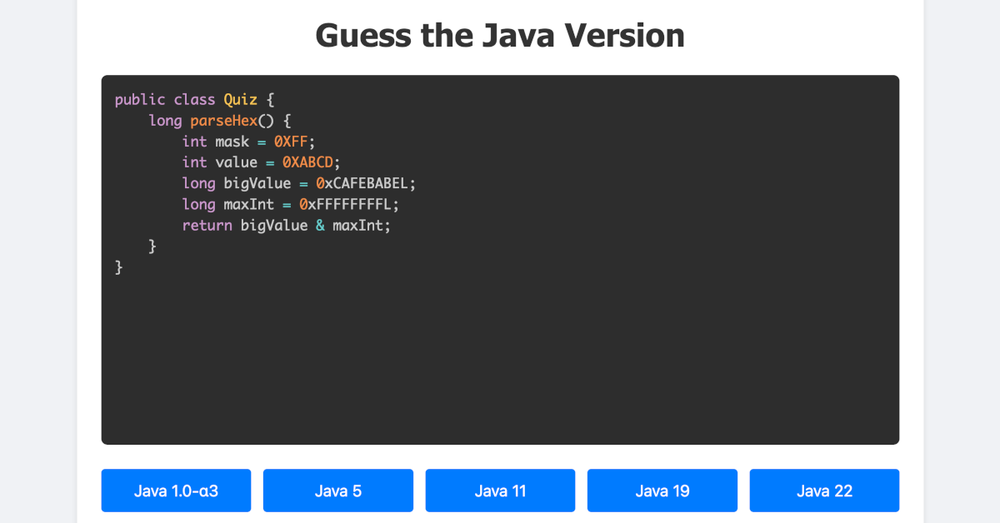

Java Version Game
=================



A simple game to learn and practice Java version features.

Also includes Java 1.0-alpha1, Java 1.0-alpha2 and Java 1.0-alpha3 features for fun.

You can find a version of the game online at [https://mostlynerdless.de/java-game](https://mostlynerdless.de/java-game).

The source questions for the game are from the parent projects [test case files](../src/test/resources/feature_tests)
and the [alpha_features.json](./alpha_features.json) file.

Build
-----

Run from the parent directory (check-language-version):

```shell
python3 game/generate_quiz.py --goatcounter https://goatcounter.mostlynerdless.de/
```

Contributing
------------
Feel free to suggest new code snippets or report issues via GitHub issues.

License
-------
Apache License 2.0