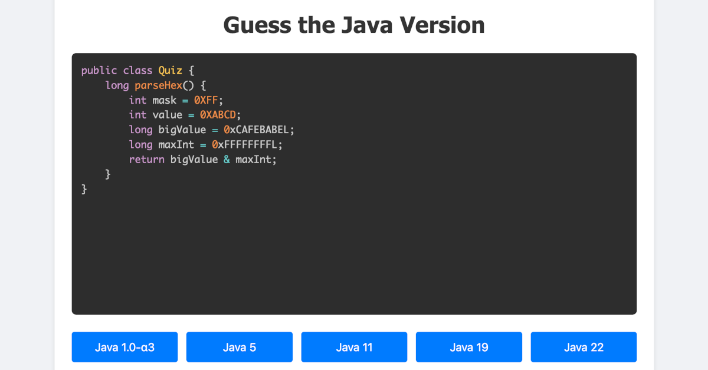

Java Version Game
=================



A simple game to learn and practice Java version features.

Alpha questions (Java 1.0-alpha1, Java 1.0-alpha2 and Java 1.0-alpha3) are shipped,
but disable by default.

You can find a version of the game online at [https://mostlynerdless.de/java-game](https://mostlynerdless.de/java-game).
The version [https://mostlynerdless.de/java-game#alpha](https://mostlynerdless.de/java-game#alpha) enables the alpha questions.

The source questions for the game are from the parent projects [test case files](../src/test/resources/feature_tests)
and the [alpha_features.json](./alpha_features.json) file.

You can find the feature descriptions in the [features](../src/main/resources/me/bechberger/check/features) folder.

Contributions are welcome.

Submitting New Questions
------------------------
To submit new questions, please open an issue on this repository
with the code snippet and the required Java version.
Or create a pull request.

Improving the Feature Descriptions
----------------------------------
Please modify or add to the files in the [features](../src/main/resources/me/bechberger/check/features) folder,
adhering to [feature-descriptions.format](../src/main/resources/me/bechberger/check/feature-descriptions.format) format,
in a pull request.

Additional Game
---------------
There is also the [Object Sizes Quiz](https://mostlynerdless.de/sizes-game) which is a similar game to learn about the sizes of Java objects.
To contribute to that game, please check the [object-sizes-quiz](../object-sizes-quiz) directory.

Build
-----

Run from the parent directory (check-language-version):

```shell
python3 game/generate_quiz.py --base-url https://mostlynerdless.de/java-game/ \
  --goatcounter https://....mostlynerdless.de/
```

Multiplayer Conference Game
---------------------------

The `conference/` directory contains a real-time multiplayer quiz built on Node.js + WebSockets.
A presenter controls the game from a dashboard; players join on their phones or laptops and
answer questions live with a server-enforced timer.

### Quick start with `run_game.sh`

A single script handles everything – generating quiz data, installing npm dependencies,
building the webpack bundles, and starting the server.

**Foreground (production)**

```shell
# run from the game/ directory or from the project root
./game/run_game.sh --secret "your-password"
```

**Dev mode** – webpack rebuilds the frontend automatically whenever you edit `src/`; nodemon
(if installed) restarts the server when `server.js` changes:

```shell
./game/run_game.sh --dev --secret "your-password"
```

**Background on a server (Uberspace / supervisord)** – installs two supervisor daemons that
survive reboots and auto-reload on code changes:

```shell
./game/run_game.sh --setup-supervisor --secret "your-password" --port 3000
```

This creates two `~/etc/services.d/` entries:

| Program | What it does |
|---|---|
| `java-quiz-webpack` | `webpack --watch` – rebuilds bundles when `src/` changes |
| `java-quiz-server` | Node server (via nodemon) – restarts when `server.js` changes |

Useful follow-up commands:

```shell
supervisorctl status
supervisorctl tail -f java-quiz-server
supervisorctl restart java-quiz-server
```

To remove the services:

```shell
./game/run_game.sh --teardown-supervisor
```

**All options**

| Flag | Default | Description |
|---|---|---|
| `--dev` | – | Foreground dev mode (webpack watch + nodemon) |
| `--setup-supervisor` | – | Install & start supervisord services |
| `--teardown-supervisor` | – | Stop & remove supervisord services |
| `--port PORT` | `3000` | Server port |
| `--secret SECRET` | `changeme` | Presenter / admin password |
| `--base-url URL` | `http://localhost:PORT/` | Base URL for quiz JSON generation |
| `--service-name NAME` | `java-quiz` | Supervisord program name prefix |
| `--supervisor-dir DIR` | `~/etc/services.d` | Where to write `.ini` files |
| `--skip-generate` | – | Skip `generate_quiz.py` (reuse existing JSON) |
| `--skip-install` | – | Skip `npm install` |

Once the server is running:

- **Players** → `http://localhost:3000/` – enter the Session ID shown by the presenter
- **Presenter** → `http://localhost:3000/presenter` – log in with your secret, create a session, start questions

### URL parameters

Both the player and presenter pages support the following query parameters:

| Parameter | Example | Description |
|---|---|---|
| `theme` | `?theme=dark` | Force light or dark mode (`light` / `dark`) |
| `secret` | `?secret=mypass` | Auto-authenticate the presenter (skips the login screen) |

Parameters can be combined: `?secret=mypass&theme=dark`

### Embedding in a Slidev presentation

You can embed the presenter view directly into a [Slidev](https://sli.dev) slide using an
iframe. This is useful for running the quiz from within your talk deck.

1. **Start the quiz server** (e.g. on port 3003):

   ```shell
   ./game/run_game.sh --secret "your-password" --port 3003
   ```

2. **Create a Slidev slide** that contains an iframe pointing to the presenter view.
   Use the `?secret=` parameter so you don't have to type the password interactively,
   and `?theme=dark` if your slides use a dark background:

   ```md
   ---
   layout: iframe
   url: http://localhost:3003/presenter?secret=your-password&theme=dark
   ---
   ```

   Or, if you prefer more control, use a raw iframe in a regular slide:

   ```md
   ---
   ---

   <iframe
     src="http://localhost:3003/presenter?secret=your-password&theme=dark"
     style="width: 100%; height: 90%; border: none; border-radius: 8px;"
   />
   ```

3. **Player QR code**: The presenter view shows a QR code that players scan to join.
   Alternatively, put just the player join page on a slide:

   ```md
   ---
   layout: iframe
   url: http://localhost:3003/presenter/view/MySession?secret=your-password&theme=dark
   ---
   ```

   Replace `MySession` with your session name – it will be auto-created if it doesn't exist.

> **Tip:** The theme toggle (🌙 / ☀️) in the footer/header also works inside the iframe
> and persists via `localStorage`, but the `?theme=` parameter always wins on page load.

See [CONFERENCE_QUICKSTART.md](CONFERENCE_QUICKSTART.md) and [conference/README.md](conference/README.md) for more details.

TODO
----
- link JEP for every feature (if available)

License
-------
Apache License 2.0